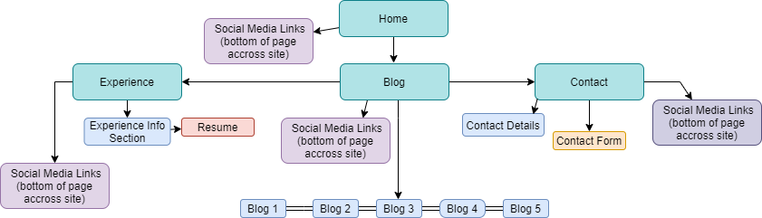
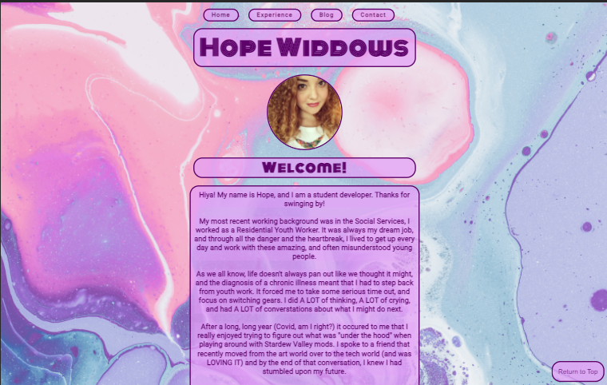
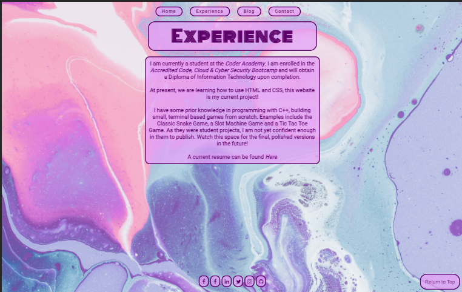
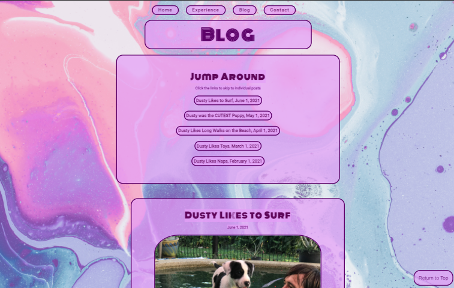
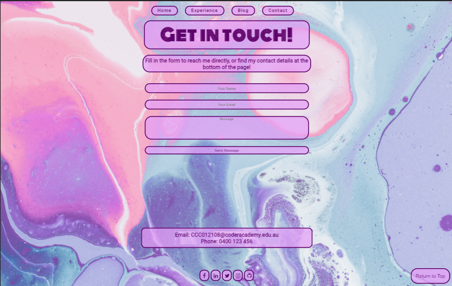

# HopeWiddows.github.io
# 
HopeWiddows Coder Academy T1A2 Portfolio for Coding, Cloud and Cyber Bootcamp  
  

### A link (URL) to published portfolio website  
https://HopeWiddows.github.io    

### A link to code repository (repo)  
https://github.com/HopeWiddows/HopeWiddows.github.io.git  

# Description of portfolio website: 
 

## Purpose of project: 
To showcase my developing skills as I progress through my studies at Coder Academy, in the Coding, Cloud and Cyber Bootcamp. 

This website built using pure HTML and CSS (and just a smidge of JS) as an assessment piece for the bootcamp. 
   

## Functionality and Features:

I set out to design this website to express both my personality and professional skillset. 

I wanted to create a functional, and accessible website, with a bit of whimsy, but not too much clutter. 

I hope to engage users by creating a website with a fun, happy vibe that might be a little surprising when arriving at my site for the first time.

I personally enjoy bright colours and a hint of "wow" and wanted to project this through the aesthetic feel of the website. This is why I have chosen a purple and pink colour palette and attempted a semi-retro feel through uses of text and rounded content boxes. Through my research I didn't come across many portfolio websites that went for the brighter colour palette, I liked the idea of havign something that stands out, just a little. 

I designed the site to have a heavily centred layout, allowing for a lot of whitespace and ease of responsivity in design. My thought process that desiging this way, would allow for the page size or device size too change, without losing or changing too much of the overall design.

While I hope to improve accessibility and ease of use of this website over time, at this stage of development, I have included:
- Alternative texts on images
- Image description that appears when cursor hovers over images (on desktop browser)
- A button to return to the top of the page when scrolling 
- Buttons change colour when cursor hovers over them (on desktop browser)  
- Top navigation bar changes to hamburger/drop down  style when screen or device size decreases
   

## Sitemap:

   

## Screenshots:
Home Page
 

Experience Page
 

Blog Page
 

Contact Page
   

## Target audience:
The target audience for the portfolio website is an employer looking to engage a dev and/or IT professional.

*Please note:* As this project is a work in progress (as is my experience as a developer), it is in the early stages and does not yet represent a fully professional environment that's ready for showcasing to potential employers. 

This project will continue to be updated as I learn and progress through my studies, and develop projects worthy of showcasing.
 

## Tech stack:

Languages utilised:

- HTML
- CSS
- Javascript

Version Control and Deployment platforms:

- GitHub
- GitHub Pages
 

## Bibliography:

Kalaikovan, G., 2021. CSS Media Queries for Desktop, Tablet, Mobile.. [online] Gist. Available at: <https://gist.github.com/gokulkrishh/242e68d1ee94ad05f488> [Accessed 12 June 2021]. 

CSS Tutorial. (n.d.). W3Schools. Retrieved June 12, 2021, from https://www.w3schools.com/css/default.asp

How To Create a Scroll Back To Top Button. (2021). W3Schools. https://www.w3schools.com/howto/howto_js_scroll_to_top.asp

HTML Tutorial. (n.d.). W3Schools. Retrieved June 12, 2021, from https://www.w3schools.com/html/default.asp

Solodev CMS. (2016, August 25). Add a Scroll-to-Top Button to your Website. Solodev. https://www.solodev.com/blog/web-design/add-a-scroll-to-top-button-to-your-website.stml

Tutorials, E. (2018, February 11). Create Working Contact Form Using HTML, CSS, PHP | Contact Form Design. YouTube. https://www.youtube.com/watch?v=Iv93yjdvkWI&feature=youtu.be

W3.CSS Home. (n.d.). W3Schools. Retrieved June 12, 2021, from https://www.w3schools.com/w3css/

CSS Color Codes. (n.d.). Quackit - CSS Color Codes. Retrieved June 12, 2021, from https://www.quackit.com/css/css_color_codes.cfm

[Image by Pawel Czerwinski]. (n.d.). https://images.unsplash.com/photo-1588097237448-45f7aadebae1?ixid=MnwxMjA3fDB8MHxwaG90by1wYWdlfHx8fGVufDB8fHx8&ixlib=rb-1.2.1&auto=format&fit=crop&w=1050&q=80
